# 📚 Learning Agent System - Complete Technical Documentation

## Table of Contents
1. [Project Overview](#project-overview)
2. [Architecture](#architecture)
3. [System Components](#system-components)
4. [File Structure & Descriptions](#file-structure--descriptions)
5. [Workflow Diagrams](#workflow-diagrams)
6. [Installation & Setup](#installation--setup)
7. [Usage Guide](#usage-guide)
8. [Technical Specifications](#technical-specifications)
9. [API Reference](#api-reference)
10. [Development Guidelines](#development-guidelines)

---

## Project Overview

### Purpose
The **Learning Agent System** is an autonomous AI-powered tutoring platform that provides personalized, structured learning experiences through sequential checkpoint-based progression. Built on LangGraph, it combines intelligent content retrieval, adaptive assessment, and the Feynman Technique to ensure deep conceptual understanding.

### Key Objectives
- **Structured Guidance**: Sequential checkpoint-based learning paths
- **Flexible Content**: Dynamic web search + user-provided materials
- **Rigorous Assessment**: 70% mastery threshold enforcement
- **Adaptive Simplification**: Feynman Technique for concept re-teaching
- **Mastery-Based Progression**: No advancement without demonstrated understanding
- **User Interface**: Professional web UI and CLI options

### Core Capabilities
- ✅ Multi-checkpoint learning path orchestration
- ✅ Dynamic content retrieval and validation
- ✅ AI-powered question generation (4 questions per checkpoint)
- ✅ Automated answer evaluation with detailed feedback
- ✅ Adaptive concept simplification using Feynman Technique
- ✅ Document upload support (PDF, DOCX, MD, TXT)
- ✅ Custom topic creation
- ✅ LangSmith integration for workflow observability
- ✅ ChromaDB vector storage for semantic search
- ✅ Professional Streamlit web interface

---

## Architecture

### High-Level System Architecture


### Technology Stack

| Layer | Technology | Purpose |
|-------|-----------|---------|
| **Framework** | LangGraph 0.2+ | Stateful workflow orchestration |
| **LLM** | Ollama (llama3.1) | AI reasoning and generation |
| **Web UI** | Streamlit 1.31+ | Professional web interface |
| **Vector Store** | ChromaDB 0.4+ | Document embeddings and retrieval |
| **Search** | DuckDuckGo | Dynamic content discovery |
| **Embeddings** | SentenceTransformers | Text vectorization |
| **Document Processing** | PyPDF2, python-docx | File upload support |
| **Monitoring** | LangSmith | Workflow tracing and debugging |
| **Environment** | Python 3.8+ | Core runtime |

---

## System Components

### 1. **Workflow Engine** (LangGraph)
The core orchestration system managing the complete learning lifecycle through a state machine:

**States:**
- `initialize` → Define checkpoint and objectives
- `collect_materials` → Gather user notes + web content
- `summarize_materials` → Condense collected materials
- `evaluate_milestone1` → Validate content relevance
- `process_context` → Chunk and embed content
- `generate_questions` → Create assessment questions
- `verify_understanding` → Evaluate learner responses
- `check_threshold` → Compare score vs 70% threshold
- `complete_checkpoint` ✅ / `feynman_teaching` 🔄

**Routing Logic:**
- Score ≥ 70% → Progress to next checkpoint
- Score < 70% → Feynman re-teaching → Retry questions

### 2. **LLM Service**
Handles all AI operations through Ollama integration:
- Question generation (4 questions per checkpoint)
- Answer simulation (for testing)
- Answer evaluation and scoring
- Concept extraction
- Simplified explanation generation

### 3. **Feynman Teacher**
Implements adaptive teaching methodology:
- Identifies knowledge gaps from low-scoring answers
- Generates simplified explanations with analogies
- Uses simpler vocabulary and concrete examples
- Manages retry attempts (max 3 retries)

### 4. **Context Processing Pipeline**
Multi-stage content preparation:
1. **Collection**: User uploads + web search
2. **Validation**: Relevance scoring against checkpoint objectives
3. **Processing**: Text chunking (500-1000 chars)
4. **Embedding**: Vector generation with SentenceTransformers
5. **Storage**: ChromaDB persistence with metadata

### 5. **User Interface**
Dual interface support:
- **Streamlit Web UI**: Professional interface with progress tracking, file uploads, custom topics
- **CLI**: Terminal-based interactive sessions

---

## File Structure & Descriptions

### Root Directory
```
Project/
├── app.py                      # Main Streamlit web application (762 lines)
├── requirements.txt            # Python dependencies
├── goal.json                   # Project objectives and design specifications
├── custom_topics.json          # User-created learning topics
├── learning_agent.log          # Application logs
├── README.md                   # Quick start guide
├── LICENSE                     # Project license
├── .env                        # Environment variables (API keys)
├── .gitignore                  # Git exclusions
├── .streamlit/                 # Streamlit configuration
│   └── config.toml            # UI theme settings
├── chroma_db/                  # ChromaDB vector database
├── .venv/                      # Python virtual environment
└── src/                        # Source code modules
```

### Source Modules (`src/`)

#### **Core Workflow Files**

##### `workflow.py` (142 lines)
**Purpose**: LangGraph workflow creation and routing logic  
**Key Functions**:
- `create_unified_workflow()` - Creates complete CLI workflow with all nodes
- `create_question_generation_workflow()` - Creates partial workflow for Streamlit (stops before CLI prompts)
- `_route_after_threshold_check()` - Routes to completion or Feynman teaching based on score
- `_route_after_feynman()` - Decides retry or end after teaching

**Dependencies**: LangGraph, workflow_nodes, models

---

##### `workflow_nodes.py` (~800 lines)
**Purpose**: Individual node implementations for each workflow stage  
**Key Nodes**:
- `initialize_node()` - Set up checkpoint context
- `collect_materials_node()` - Gather user materials and web content
- `summarize_materials_node()` - Condense collected materials
- `evaluate_milestone1_node()` - Validate content quality
- `process_context_node()` - Chunk and embed content
- `generate_questions_node()` - Create assessment questions
- `verify_understanding_node()` - Evaluate learner answers
- `check_threshold_node()` - Compare score to 70% threshold
- `complete_checkpoint_node()` - Mark checkpoint as complete
- `feynman_teaching_node()` - Generate simplified explanations

**Dependencies**: All service modules (LLM, context, document processor)

---

##### `models.py` (92 lines)
**Purpose**: TypedDict definitions and data models  
**Key Models**:
- `LearningAgentState` - Complete workflow state
- `Checkpoint` - Learning milestone definition
- `Material` - Learning content structure
- `ProcessedContext` - Embedded context chunk
- `GeneratedQuestion` - Question with metadata
- `LearnerAnswer` - User response structure
- `VerificationResult` - Evaluation results

**Dependencies**: Python typing module

---

#### **AI & Intelligence Layer**

##### `llm_service.py` (567 lines)
**Purpose**: LLM integration for all AI operations  
**Key Methods**:
- `generate_questions()` - Creates 4 contextual questions
- `simulate_learner_answer()` - Generates test answers
- `evaluate_answer_with_rag()` - Scores answers using context
- `extract_concepts()` - Identifies key concepts from text
- `generate_feynman_explanation()` - Creates simplified explanations

**AI Model**: Ollama (llama3.1:latest)  
**Integration**: LangChain OllamaLLM  
**Monitoring**: LangSmith tracing decorators

---

##### `feynman_teaching.py` (295 lines)
**Purpose**: Adaptive teaching using Feynman Technique  
**Key Methods**:
- `identify_knowledge_gaps()` - Analyzes incorrect answers
- `generate_simplified_explanation()` - Creates simplified content
- `generate_analogy()` - Produces relevant analogies
- `generate_all_explanations()` - Batch explanation generation

**Teaching Strategy**:
1. Identify questions with score < 0.7
2. Extract concepts from weak areas
3. Generate simple explanations with analogies
4. Present teaching material
5. Request retry (max 3 attempts)

---

#### **Content Processing**

##### `context_processor.py` (~400 lines)
**Purpose**: Text chunking and embedding generation  
**Key Functions**:
- `chunk_text()` - Splits text into 500-1000 char chunks
- `generate_embeddings()` - Creates vector embeddings
- `store_in_vector_db()` - Persists to ChromaDB
- `retrieve_relevant_chunks()` - Semantic similarity search

**Embedding Model**: SentenceTransformers (all-MiniLM-L6-v2)  
**Chunk Strategy**: Recursive character splitting with overlap

---

##### `document_processor.py` (302 lines)
**Purpose**: Extract text from various file formats  
**Supported Formats**:
- PDF files (PyPDF2)
- Word documents (python-docx)
- Markdown files (native parsing)
- Plain text files (UTF-8)

**Key Methods**:
- `detect_file_type()` - Auto-detect format from extension
- `extract_text_from_pdf()` - PDF text extraction
- `extract_text_from_docx()` - Word document parsing
- `extract_text_from_markdown()` - Markdown parsing
- `process_uploaded_file()` - Unified file processing

---

##### `context_validation.py` (~200 lines)
**Purpose**: Validate content relevance to learning objectives  
**Key Functions**:
- `calculate_relevance_score()` - Scores content against requirements
- `validate_context_coverage()` - Checks topic coverage
- `identify_missing_concepts()` - Detects content gaps

**Scoring Algorithm**: Keyword matching + semantic similarity (0.0-1.0 scale)

---

##### `web_search.py` (~150 lines)
**Purpose**: Dynamic web content retrieval  
**Search Engine**: DuckDuckGo  
**Key Functions**:
- `search_web()` - Execute search queries
- `extract_content()` - Parse search results
- `generate_search_query()` - Optimize query from checkpoint

**Rate Limiting**: Built-in throttling to respect API limits

---

#### **User Interaction**

##### `user_interaction.py` (~200 lines)
**Purpose**: Collect and manage user inputs  
**Key Functions**:
- `collect_user_answers()` - Gather responses to questions (CLI)
- `display_score_feedback()` - Show evaluation results
- `confirm_progression()` - Get user confirmation

**Interface**: CLI-based input/output

---

##### `file_upload.py` (~150 lines)
**Purpose**: Handle file uploads in Streamlit  
**Key Functions**:
- `get_upload_handler()` - Initialize upload manager
- `process_uploaded_files()` - Handle multiple files
- `validate_file_size()` - Check file constraints

**Constraints**: Max 10MB per file, specific formats only

---

#### **Data Management**

##### `custom_topics.py` (~100 lines)
**Purpose**: Create and manage user-defined learning topics  
**Storage**: JSON file (`custom_topics.json`)  
**Key Functions**:
- `load_custom_topics()` - Read from JSON
- `add_custom_topic()` - Create new topic
- `create_topic_wizard()` - Streamlit topic creator

**Topic Structure**:
```json
{
  "id": "unique_id",
  "name": "Topic Name",
  "description": "Auto-generated",
  "checkpoints": []
}
```

---

##### `sample_data.py` (~300 lines)
**Purpose**: Predefined learning paths for testing  
**Included Paths**:
- Data Structures & Algorithms
- Machine Learning Fundamentals
- Web Development (React + Node.js)
- System Design

**Function**: `create_learning_paths()` - Returns all sample paths

---

##### `dynamic_materials.py` (~250 lines)
**Purpose**: Generate learning materials dynamically  
**Key Functions**:
- `generate_checkpoint_materials()` - Create content for checkpoint
- `retrieve_relevant_materials()` - Fetch from vector DB
- `augment_with_web_search()` - Supplement with web content

---

#### **Configuration & Utilities**

##### `langsmith_config.py` (~100 lines)
**Purpose**: LangSmith monitoring integration  
**Key Functions**:
- `langsmith_config()` - Initialize tracing
- `get_langsmith_callbacks()` - Return callback handlers
- `trace_llm_operation()` - Decorator for operation tracing

**Environment Variables**:
- `LANGCHAIN_API_KEY`
- `LANGCHAIN_PROJECT`
- `LANGCHAIN_TRACING_V2`

---

##### `main.py` (~200 lines)
**Purpose**: CLI entry point for multi-checkpoint sessions  
**Usage**: `python -m src.main`  
**Flow**: Initialize → Select path → Execute checkpoints → Track progress

---

##### `multi_checkpoint.py` (~400 lines)
**Purpose**: Multi-checkpoint session orchestration  
**Key Functions**:
- `run_multi_checkpoint_session()` - Execute complete learning path
- `track_checkpoint_progress()` - Monitor completion
- `determine_next_checkpoint()` - Sequential progression

---

##### `__init__.py`
**Purpose**: Package initialization and exports  
**Exports**: All major functions and classes for external use

---

### Application Files

#### `app.py` (762 lines)
**Purpose**: Main Streamlit web application  
**Features**:
- Modern responsive UI with custom theme
- File upload with drag-and-drop
- Custom topic creation wizard
- Real-time progress tracking
- Ollama status indicator
- Session state management
- Error handling with user-friendly messages

**Key Sections**:
- `render_header()` - Title and status bar
- `render_learning_path_selector()` - Path selection UI
- `render_file_upload()` - Document upload interface
- `render_learning_session()` - Active learning interface
- `render_results()` - Score display and progression
- `render_feynman_teaching()` - Adaptive teaching UI

**Session State Variables**:
- `selected_path` - Current learning path
- `current_checkpoint_index` - Progress tracker
- `learning_state` - Workflow state
- `questions` - Generated questions
- `answers` - User responses
- `stage` - UI stage (path_selection, learning, results, feynman)

---

#### `.streamlit/config.toml`
**Purpose**: Streamlit UI theme configuration  
**Customizations**:
- Primary color: #FF4B4B
- Background color: #FFFFFF
- Secondary background: #F0F2F6
- Font: Sans-serif
- Wide mode enabled

---

#### `requirements.txt` (56 lines)
**Purpose**: Python dependency specifications  
**Categories**:
- **Core**: LangGraph, LangChain, LangChain-Community
- **LLM**: langchain-ollama, ollama
- **Vector DB**: ChromaDB, sentence-transformers
- **Web UI**: Streamlit
- **Document Processing**: PyPDF2, python-docx
- **Utilities**: python-dotenv, httpx, nest-asyncio

**Installation**: `pip install -r requirements.txt`

---

## Workflow Diagrams

### Complete Learning Workflow


### Streamlit UI Flow


### Content Processing Pipeline


### Feynman Teaching Process

```mermaid
sequenceDiagram
    participant L as Learner
    participant S as System
    participant F as Feynman Teacher
    participant LLM as LLM Service
    
    L->>S: Submit Answers
    S->>S: Evaluate (Score: 45%)
    S->>F: Score < 70%, Trigger Teaching
    F->>F: Identify Knowledge Gaps
    F->>LLM: Request Simplified Explanation
    LLM-->>F: Generate Analogies
    F->>L: Present Simplified Content
    L->>L: Review Teaching Material
    F->>S: Request Retry (Attempt 1/3)
    S->>S: Generate New Questions
    S->>L: Present Questions Again
    L->>S: Submit New Answers
    S->>S: Re-evaluate
    
    alt Score >= 70%
        S->>L: ✅ Checkpoint Complete
    else Score < 70% and Retries < 3
        S->>F: Continue Teaching
    else Max Retries Reached
        S->>L: ⚠️ Suggest Review & Retry Later
    end
```



### Question Generation Algorithm


---

## Installation & Setup

### Prerequisites
- **Python**: 3.8 or higher
- **Ollama**: Installed and running (`ollama serve`)
- **Git**: For cloning repository
- **Operating System**: Windows, macOS, or Linux

### Step-by-Step Installation

#### 1. Clone Repository
```bash
git clone <repository-url>
cd Project
```

#### 2. Create Virtual Environment
```bash
# Windows
python -m venv .venv
.venv\Scripts\activate

# macOS/Linux
python3 -m venv .venv
source .venv/bin/activate
```

#### 3. Install Dependencies
```bash
pip install -r requirements.txt
```

#### 4. Install Ollama
Visit [ollama.com](https://ollama.com) and install for your OS.

```bash
# Pull the required model
ollama pull llama3.1
```

#### 5. Configure Environment Variables
Create `.env` file in project root:
```env
# LangSmith (Optional - for monitoring)
LANGCHAIN_API_KEY=your_api_key_here
LANGCHAIN_PROJECT=learning-agent
LANGCHAIN_TRACING_V2=true

# Ollama Configuration
OLLAMA_MODEL=llama3.1:latest
OLLAMA_BASE_URL=http://localhost:11434
```

#### 6. Verify Installation
```bash
# Test Ollama connection
python -c "from src.llm_service import LLMService; print('✓ LLM Service Ready')"

# Test all imports
python -c "from src import *; print('✓ All modules imported successfully')"
```

### First Run

#### Web Application
```bash
streamlit run app.py
```
Access at: http://localhost:8501

#### CLI Application
```bash
python -m src.multi_checkpoint
```

---

## Usage Guide

### Web Application (Streamlit)

#### Starting a Learning Session

1. **Launch Application**
   ```bash
   streamlit run app.py
   ```

2. **Select Learning Path**
   - Choose from predefined paths (Data Structures, ML, Web Dev, System Design)
   - OR create custom topic with topic name

3. **Upload Materials (Optional)**
   - Drag & drop PDF/DOCX/MD/TXT files
   - Max 10MB per file
   - System automatically extracts and processes text

4. **Begin Learning**
   - Click "Start Learning Session"
   - System gathers context from uploads + web search
   - Generates 4 questions per checkpoint

5. **Answer Questions**
   - Type answers in provided text areas
   - Minimum 20 characters per answer
   - Click "Submit Answers" when ready

6. **View Results**
   - See detailed score (0-100%)
   - Read feedback for each question
   - If score >= 70%: Progress to next checkpoint
   - If score < 70%: Receive Feynman teaching

7. **Feynman Teaching (if needed)**
   - Review simplified explanations
   - Study analogies and examples
   - Click "I understand, retry questions"
   - Maximum 3 retry attempts

8. **Complete Path**
   - Progress through all checkpoints
   - Track completion status
   - View final summary

#### Custom Topic Creation

1. Click "📝 Create Custom Topic"
2. Enter topic name (e.g., "Quantum Computing Basics")
3. System auto-generates:
   - Unique ID
   - Description
   - Saves to `custom_topics.json`

### CLI Application

#### Running Multi-Checkpoint Session
```bash
python -m src.multi_checkpoint
```

**Interactive Flow**:
1. Select learning path from menu
2. System executes workflow automatically
3. Questions displayed in terminal
4. Type answers and press Enter
5. View scores and feedback
6. Automatic progression or Feynman teaching
7. Continue until all checkpoints complete

#### Running Single Checkpoint (Testing)
```bash
python -m src.main
```

### Programming API

#### Using Workflows Programmatically

```python
from src.workflow import create_unified_workflow
from src.models import LearningAgentState
from src.sample_data import create_learning_paths

# Create workflow
workflow = create_unified_workflow()
app = workflow.compile()

# Prepare initial state
paths = create_learning_paths()
checkpoint = paths[0]['checkpoints'][0]

initial_state = {
    "checkpoint": checkpoint,
    "context_chunks": [],
    "questions": [],
    "verification_results": []
}

# Execute workflow
result = app.invoke(initial_state)
print(f"Score: {result.get('understanding_score', 0)}")
```

#### Custom Document Processing

```python
from src.document_processor import DocumentProcessor

processor = DocumentProcessor()

# Process PDF
text = processor.extract_text_from_pdf("path/to/file.pdf")

# Process Word document
text = processor.extract_text_from_docx("path/to/file.docx")

# Detect format automatically
file_type = processor.detect_file_type("document.pdf")  # Returns 'pdf'
```

#### Using LLM Service

```python
from src.llm_service import LLMService
import asyncio

llm_service = LLMService()

# Generate questions
context_chunks = [{"text": "Python is a programming language...", "chunk_id": "1"}]
requirements = ["Understand Python basics", "Know data types"]

questions = asyncio.run(
    llm_service.generate_questions(context_chunks, requirements)
)

# Evaluate answer
score = asyncio.run(
    llm_service.evaluate_answer_with_rag(
        question="What is Python?",
        answer="Python is a high-level programming language",
        context_chunks=context_chunks
    )
)
```

---

## Technical Specifications

### State Management

#### LearningAgentState Structure
```python
{
    # Checkpoint definition
    "checkpoint": Checkpoint,
    "checkpoint_requirements": List[str],
    
    # Content collection
    "collected_materials": List[Material],
    "summarized_materials": str,
    "milestone1_score": float,
    "context_is_relevant": bool,
    
    # Processed context
    "context_chunks": List[ProcessedContext],
    
    # Question generation
    "questions": List[GeneratedQuestion],
    
    # User interaction
    "learner_answers": List[LearnerAnswer],
    
    # Evaluation
    "verification_results": List[VerificationResult],
    "understanding_score": float,
    "meets_threshold": bool,
    
    # Feynman teaching
    "feynman_explanations": List[Dict],
    "feynman_retry_requested": bool,
    "feynman_retry_count": int,
    
    # Metadata
    "checkpoint_completed": bool,
    "completion_timestamp": str
}
```

### Question Format

#### Generated Question Structure
```python
{
    "question_id": "q_001",
    "question": "What is the time complexity of binary search?",
    "context_chunks": ["chunk_001", "chunk_003"],
    "expected_concepts": ["O(log n)", "divide and conquer"]
}
```

### Evaluation Metrics

#### Answer Scoring Algorithm
1. **Keyword Matching** (40% weight)
   - Extract expected concepts from context
   - Check presence in answer
   - Score: matches / total_concepts

2. **Semantic Similarity** (40% weight)
   - Embed answer and context chunks
   - Calculate cosine similarity
   - Score: max_similarity

3. **Completeness** (20% weight)
   - Answer length >= 50 chars: Full points
   - 20-50 chars: Partial points
   - < 20 chars: Low points

**Final Score** = (0.4 × keyword_score) + (0.4 × semantic_score) + (0.2 × completeness_score)

#### Threshold Enforcement
- **Pass**: Score >= 0.70 (70%)
- **Fail**: Score < 0.70 → Trigger Feynman teaching
- **Max Retries**: 3 attempts per checkpoint

### Database Schema

#### ChromaDB Collections
```python
# Collection: "learning_context"
{
    "ids": ["chunk_001", "chunk_002", ...],
    "documents": ["Text content...", ...],
    "embeddings": [[0.1, 0.2, ...], ...],
    "metadatas": [
        {
            "checkpoint_id": "ds_001",
            "source": "web_search",
            "timestamp": "2026-01-18T10:30:00"
        },
        ...
    ]
}
```

### Error Handling

#### Ollama Connection
- **Check**: HTTP request to `http://localhost:11434`
- **Fallback**: Display user-friendly error with setup instructions
- **Retry**: No automatic retry (user must fix)

#### File Upload
- **Validation**: Size limit 10MB, format check
- **Error Messages**: Specific guidance for each error type
- **Recovery**: Allow re-upload without session loss

#### LLM Failures
- **Timeout**: 30 seconds per operation
- **Parsing Errors**: Retry with clearer prompt
- **Max Retries**: 3 attempts before fallback

---

## API Reference

### Workflow Functions

#### `create_unified_workflow()`
Creates complete learning workflow with all nodes.

**Returns**: `StateGraph` - Compiled LangGraph workflow

**Usage**:
```python
workflow = create_unified_workflow()
app = workflow.compile()
result = app.invoke(initial_state)
```

---

#### `create_question_generation_workflow()`
Creates partial workflow for Streamlit (stops before CLI prompts).

**Returns**: `StateGraph` - Workflow ending at question generation

---

### LLM Service Methods

#### `LLMService.generate_questions(context_chunks, checkpoint_requirements)`
Generate assessment questions.

**Parameters**:
- `context_chunks` (List[ProcessedContext]): Embedded content
- `checkpoint_requirements` (List[str]): Learning objectives

**Returns**: `List[GeneratedQuestion]` - 4 questions

---

#### `LLMService.evaluate_answer_with_rag(question, answer, context_chunks)`
Score answer using RAG.

**Parameters**:
- `question` (str): The question asked
- `answer` (str): Learner's response
- `context_chunks` (List[ProcessedContext]): Reference context

**Returns**: `float` - Score between 0.0 and 1.0

---

### Feynman Teacher Methods

#### `FeynmanTeacher.identify_knowledge_gaps(verification_results)`
Identify concepts needing simplification.

**Parameters**:
- `verification_results` (List[Dict]): Evaluation results

**Returns**: `List[Dict]` - Knowledge gaps with severity

---

#### `FeynmanTeacher.generate_simplified_explanation(concept, context_chunks)`
Create Feynman-style explanation.

**Parameters**:
- `concept` (str): Concept to explain
- `context_chunks` (List[ProcessedContext]): Reference material

**Returns**: `str` - Simplified explanation with analogies

---

### Document Processor Methods

#### `DocumentProcessor.extract_text_from_pdf(file_path)`
Extract text from PDF file.

**Parameters**:
- `file_path` (str): Path to PDF file

**Returns**: `str` - Extracted text content

**Raises**: `Exception` if file cannot be read

---

### Context Validation Functions

#### `calculate_relevance_score(text, requirements)`
Score content relevance to objectives.

**Parameters**:
- `text` (str): Content to evaluate
- `requirements` (List[str]): Learning objectives

**Returns**: `float` - Relevance score 0.0-1.0

---

## Development Guidelines

### Code Structure

#### Module Organization
- **One responsibility per file**
- **Clear naming conventions**: `snake_case` for functions, `PascalCase` for classes
- **Comprehensive docstrings**: Google style
- **Type hints**: All function signatures

#### Example Module Structure
```python
"""
Module description.

Detailed explanation of module purpose and capabilities.
"""

import logging
from typing import List, Dict, Optional

logger = logging.getLogger(__name__)

class ServiceName:
    """Service description."""
    
    def __init__(self):
        """Initialize service."""
        pass
    
    def method_name(self, param: str) -> Dict:
        """
        Method description.
        
        Args:
            param: Parameter description
            
        Returns:
            Return value description
            
        Raises:
            Exception: When error occurs
        """
        logger.info(f"Processing {param}")
        return {}
```

### Testing Strategy

#### Unit Tests
```python
# tests/test_llm_service.py
import pytest
from src.llm_service import LLMService

def test_question_generation():
    """Test question generation with sample context."""
    llm = LLMService()
    context = [{"text": "Python is...", "chunk_id": "1"}]
    requirements = ["Understand Python"]
    
    questions = asyncio.run(llm.generate_questions(context, requirements))
    
    assert len(questions) == 4
    assert all('question' in q for q in questions)
```

#### Integration Tests
```python
# tests/test_workflow.py
def test_complete_workflow():
    """Test end-to-end workflow execution."""
    workflow = create_unified_workflow()
    app = workflow.compile()
    
    initial_state = {...}
    result = app.invoke(initial_state)
    
    assert 'understanding_score' in result
    assert result['checkpoint_completed'] == True
```

### Adding New Features

#### Adding a New Node
1. **Define in `workflow_nodes.py`**:
```python
def new_node(state: LearningAgentState) -> LearningAgentState:
    """New node description."""
    logger.info("🔧 Executing new node")
    
    # Node logic here
    state["new_field"] = "value"
    
    return state
```

2. **Register in `workflow.py`**:
```python
workflow.add_node("new_node", new_node)
workflow.add_edge("previous_node", "new_node")
```

3. **Update `models.py`**:
```python
class LearningAgentState(TypedDict):
    ...
    new_field: str  # Add new field
```

#### Adding New Document Format
1. **Update `document_processor.py`**:
```python
def extract_text_from_new_format(self, file_path: str) -> str:
    """Extract from new format."""
    # Implementation
    return extracted_text

# Update supported_formats
self.supported_formats.append('.new')
```

2. **Update `requirements.txt`**:
```txt
new-format-library>=1.0.0
```

### Performance Optimization

#### Caching Strategies
- **Vector DB**: ChromaDB persistent storage
- **Session State**: Streamlit session_state for UI
- **LangGraph**: Built-in checkpointing

#### Async Operations
```python
# Use async for I/O operations
async def process_multiple_files(files: List[str]):
    tasks = [process_file(f) for f in files]
    return await asyncio.gather(*tasks)
```

### Logging Best Practices

#### Log Levels
- **DEBUG**: Detailed debugging information
- **INFO**: General workflow progress (✅ ❌ 🔄 emojis)
- **WARNING**: Unusual situations
- **ERROR**: Error events

#### Example
```python
logger.info("✅ Questions generated successfully")
logger.warning("⚠️ Context relevance below optimal")
logger.error("❌ Failed to connect to Ollama")
```

### Security Considerations

#### Environment Variables
- **Never commit `.env` to repository**
- **Use python-dotenv for loading**
- **Validate all API keys before use**

#### File Upload Security
- **Validate file types**: Whitelist only safe formats
- **Check file sizes**: Enforce limits
- **Sanitize filenames**: Remove special characters
- **Scan content**: Validate before processing

#### LLM Safety
- **Input validation**: Sanitize user inputs
- **Output filtering**: Check generated content
- **Rate limiting**: Prevent abuse

---

## Troubleshooting

### Common Issues

#### Ollama Not Running
**Symptom**: `WinError 10061 - No connection could be made`

**Solution**:
```bash
# Start Ollama server
ollama serve

# Verify model is pulled
ollama list
ollama pull llama3.1
```

---

#### Import Errors
**Symptom**: `ModuleNotFoundError: No module named 'X'`

**Solution**:
```bash
# Reinstall dependencies
pip install -r requirements.txt

# Verify installation
pip list | grep langchain
```

---

#### ChromaDB Errors
**Symptom**: `sqlite3.OperationalError`

**Solution**:
```bash
# Delete and reinitialize database
rm -rf chroma_db/
python -c "from src.context_processor import ContextProcessor; ContextProcessor()"
```

---

#### Streamlit Session Issues
**Symptom**: State not persisting between interactions

**Solution**:
- Use `st.session_state` for all persistent data
- Initialize in `if 'key' not in st.session_state:`
- Clear with browser refresh or "Clear Cache" button

---

## Contributing

### Development Workflow
1. Fork repository
2. Create feature branch: `git checkout -b feature/new-feature`
3. Make changes with tests
4. Run tests: `pytest tests/`
5. Commit: `git commit -m "Add new feature"`
6. Push: `git push origin feature/new-feature`
7. Create Pull Request

### Code Review Checklist
- ✅ Code follows style guidelines
- ✅ All tests pass
- ✅ Documentation updated
- ✅ Type hints added
- ✅ Logging implemented
- ✅ Error handling included

---

## License

This project is licensed under the MIT License. See [LICENSE](LICENSE) file for details.

---

## Acknowledgments

- **LangChain/LangGraph**: Workflow orchestration framework
- **Ollama**: Local LLM execution
- **Streamlit**: Web UI framework
- **ChromaDB**: Vector database
- **SentenceTransformers**: Embedding models

---

## Contact & Support

For questions, issues, or contributions:
- **GitHub Issues**: Report bugs and request features
- **Documentation**: This file and inline code comments
- **LangSmith**: Monitor workflow executions at [smith.langchain.com](https://smith.langchain.com)

---