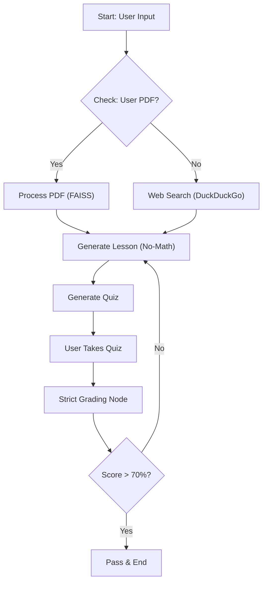

# Autonomous AI Tutor: Checkpoint Verification & Feynman Pedagogy

## 📌 Project Overview
This project implements an **Autonomous Learning Agent** designed to provide a structured, personalized tutoring experience. Unlike standard chatbots, this agent enforces a strict "Mastery-Based Progression" system. It utilizes **Retrieval-Augmented Generation (RAG)** to teach complex technical concepts and rigorously verifies user understanding through generated quizzes before allowing them to advance.

The system is built using **LangGraph** for workflow orchestration and **Streamlit** for the interactive user interface.

## 📂 Repository Structure

This repository contains two core components representing the logic and the interface of the agent:

### 1. `Milestone 2.ipynb` (Backend Logic & Research)
* **Purpose:** The core development environment for the agent's logic.
* **Key Tech:** Implements the **LangGraph StateGraph** to orchestrate the cyclic workflow (Search → Generate → Quiz → Grade → Retry).
* **Functionality:** Contains the prompt engineering for "No-Math" explanations and the strict grading algorithms used to evaluate student answers.

### 2. `app.py` (Frontend Application)
* **Purpose:** The production-ready user interface.
* **Key Tech:** **Streamlit**.
* **Functionality:** A web-based port of the backend logic that allows users to:
    * Upload lecture notes (PDF).
    * Select learning topics (e.g., CNNs, RAG, Transformers).
    * Read generated study guides.
    * Take interactive quizzes with real-time AI grading.

---

## 🚀 Key Features

* **Adaptive Context Gathering:** The agent prioritizes user-uploaded documents (PDFs) to tailor the lesson. If no documents are provided, it autonomously performs a **DuckDuckGo Web Search** to gather accurate technical details.
* **"No-Math" Conceptual Explanations:** The AI is strictly prompted to explain complex mathematical relationships (like Backpropagation gradients) using purely narrative, descriptive English to ensure accessibility.
* **Rigorous Assessment:**
    * Generates 3-5 conceptual questions based on the specific lesson content.
    * **Strict Grading:** Answers are graded on a 0-100 scale. Generic or vague answers are penalized.
    * **Threshold:** A score of **70%** is required to pass the checkpoint.
* **Feedback Loop:** The system provides detailed, corrective feedback for every question, explaining exactly why an answer was correct or incorrect.

## 🏗️ System Architecture

The agent operates on a cyclic graph architecture to ensure mastery:



🛠️ Tech Stack
Language: Python

Orchestration: LangChain & LangGraph

LLM Engine: HuggingFace Endpoint (Qwen/Qwen2.5-72B-Instruct)

Embeddings: Sentence-Transformers (all-MiniLM-L6-v2)

Vector Store: FAISS (for efficient document chunking and retrieval)

Search Tool: DuckDuckGo Search API

Frontend: Streamlit

⚙️ Setup & Installation
1. Clone the Repository

```bash
git clone [https://github.com/yourusername/autonomous-ai-tutor.git](https://github.com/yourusername/autonomous-ai-tutor.git)
cd autonomous-ai-tutor
```

2. Install Dependencies

```bash
pip install langchain langchain-huggingface langchain-community chromadb faiss-cpu duckduckgo-search streamlit
```

🖥️ Usage Guide
1. Running the Web Tutor (Frontend)
To launch the interactive application where you can upload notes and take quizzes:

```bash
streamlit run app.py
```

2. Running the Backend Logic
To inspect the internal LangGraph thought process:

```bash
jupyter notebook "Milestone 2.ipynb"
```
