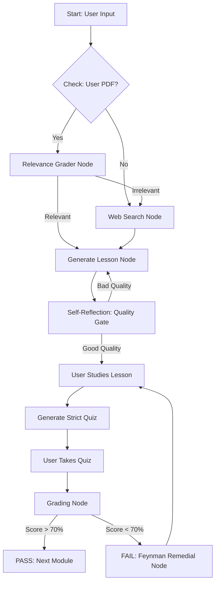

# Designing-an-Autonomous-Learning-Agent-with-Checkpoint-Verification-and-Feynman-Pedagogy-

## 📌 Project Overview
This project is an **Autonomous AI Tutor** designed to create personalized learning paths, teach complex technical concepts, and enforce mastery through rigorous assessment. Unlike standard chatbots, this system uses an **Adaptive Feedback Loop**: if a student fails a quiz, the agent switches to "Feynman Mode," re-teaching the specific weak concepts using simple analogies before re-testing.

The system is built on a **Retrieval-Augmented Generation (RAG)** architecture, allowing it to teach from both general web knowledge and specific user-uploaded documents.

---
## 🏗️ System Architecture

The agent operates on a cyclic graph architecture to ensure mastery:



## 📂 File Documentation

### 1. `app.py` (The Interactive Frontend)
**Role:** The production-ready User Interface built with Streamlit.
This file implements the full end-to-end user journey, from curriculum planning to remedial teaching.

**Key Features & Functions:**
* **Curriculum Designer:** Uses the `generate_study_plan` function to break down any topic (e.g., "Deep Learning") into 5 logical checkpoints. It intelligently prioritizes uploaded documents for context but falls back to general knowledge if the document is irrelevant.
* **RAG Lesson Generator:** The `generate_lesson_content` function validates if the uploaded document is sufficient or if web search is needed to supplement the lesson.
* **Strict Quiz Engine:** The `generate_quiz` function creates 5 open-ended conceptual questions, explicitly banning Multiple Choice Questions (MCQs) to prevent guessing.
* **Automated Grading:** The `grade_answers` function uses a strict rubric: 0 points for empty/irrelevant answers, and up to 20 points for perfect technical definitions.
* **Feynman Remedial Node:** If a user scores <70%, the `generate_remedial` function is triggered. It acts as "Richard Feynman," explaining the failed concepts using simple analogies.

**Tech Stack:** Streamlit, LangChain, Groq (Llama-3.3-70b), HuggingFace Embeddings, DuckDuckGo Search.

### 2. `Milestone 3&4.ipynb` (The Backend Logic & Research)
**Role:** The research lab and logic core.
This notebook contains the **LangGraph** implementation, demonstrating the complex state management and cyclic workflows that power the AI.

**Core Architecture (Nodes):**
* **Curriculum Node (Cell 3):** Defines the `StudyPlan` schema and generates structured learning objectives.
* **Relevance Grader (Cell 5):** An intelligent router that grades user documents as "SUFFICIENT," "INCOMPLETE," or "IRRELEVANT" to decide if web search is necessary.
* **Quality Gate (Cell 8 & 9):** A self-reflecting loop where the AI grades its *own* generated essays. If the lesson quality is below 4/5, it automatically rewrites it before showing it to the user.
* **Strict Grading Node (Cell 14):** Implements the logic to penalize vague answers and identify specific "failed concepts" for remediation.
* **LangGraph Workflow (Cell 10 & 17):** Compiles the state graph (`StateGraph`) with conditional edges that determine whether to Pass, Fail, Retry, or Search.

## 🚀 Key Features
1. **Hybrid RAG:** Intelligently switches between User Documents and DuckDuckGo Web Search.

2. **Self-Correction:** The AI evaluates its own lesson quality before showing it to the user.

3. **Anti-Hallucination Grading:** The grading engine assigns a score of 0 if an answer is vague or empty, preventing students from "tricking" the AI.

4. **Persistent Memory:** In app.py, st.session_state is used to track progress across the 5-module curriculum.

## ⚙️ Setup & Installation

**Prerequisites:**
* Python 3.10+
* API Keys: Groq, LangSmith (Optional)

**Installation:**

# 1. Clone the repository
```bash
git clone [https://github.com/your-username/ai-tutor-pro.git](https://github.com/your-username/ai-tutor-pro.git)
```

# 2. Install dependencies
```bash
pip install streamlit langchain-groq langchain-huggingface langchain-community pypdf duckduckgo-search
```

# 3. Run the application

```bash
streamlit run app.py
```
## 🖥️ Usage Guide

1. **Configuration:** Enter your Groq API Key in the sidebar.

2. **Upload Context:** Upload notes.pdf (or any educational PDF) to the sidebar.

3. **Set Topic:** Enter a topic (e.g., "Deep Learning") on the main screen and click Generate Plan.

4. **Study:** Click "Start" on Module 1. The AI will generate a lesson.

5. **Quiz:** Take the generated quiz.

      * Pass (>70%): You unlock Module 2.
