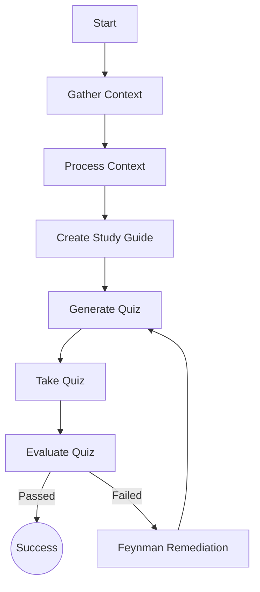

# 📘 Technical Guide: Autonomous Learning Agent Architecture

**Project Title:** Autonomous Learning Agent (ALA)
**Type:** Cognitive Architecture / Adaptive Tutoring System
**Version:** 2.0.0 (Enterprise Edition)
**Status:** Stable
**Author:** Autonomous Learning Agent Team

---

## 📑 Table of Contents
1.  [Executive Summary](#1-executive-summary)
2.  [High-Level Architecture](#2-high-level-architecture)
3.  [Detailed Component Analysis](#3-detailed-component-analysis)
4.  [The LangGraph State Machine](#4-the-langgraph-state-machine)
5.  [AI Engineering Strategy](#5-ai-engineering-strategy)
6.  [System Sequence Diagram](#6-system-sequence-diagram)
7.  [Data Schema & State Management](#7-data-schema--state-management)
8.  [Resilience & Error Handling](#8-resilience--error-handling)
9.  [Future Scope & Scalability](#9-future-scope--scalability)

---

## 1. Executive Summary
The **Autonomous Learning Agent (ALA)** is a next-generation educational tool designed to autonomously manage the teaching lifecycle. Unlike traditional Learning Management Systems (LMS) that serve static content, the ALA employs a **Cognitive Loop** to **Perceive** (research), **Process** (learn), **Act** (teach), and **Adapt** (remediate).

The system leverages **Large Language Models (Llama-3-70b)** for reasoning and **Vector Databases (ChromaDB)** for semantic memory, orchestrated by a robust **LangGraph State Machine**. Its primary innovation is the "Feynman Remediation Loop," which detects knowledge gaps in real-time and dynamically adapts the curriculum complexity to the user's proficiency level.

---

## 2. High-Level Architecture

The system does not follow a linear execution path. Instead, it operates as a **Cyclic Graph**.

### The "Perceive-Process-Act-Adapt" Cycle

1.  **🔍 Perceive (Data Ingestion)**
    *   **Trigger**: User selects a topic (e.g., "Neural Networks").
    *   **Mechanism**: The agent autonomously generates search queries (e.g., "Explain Neurons structure function").
    *   **Tool**: `DuckDuckGoSearchRun` fetches live web data, ensuring content is never outdated.
    *   **Output**: Raw, unstructured text snippets.

2.  **⚙️ Process (Memory Formulation)**
    *   **Refinement**: Raw text is cleaned and split into manageable "chunks" (500 characters).
    *   **Embedding**: Each chunk is converted into a 384-dimensional vector using `HuggingFaceEmbeddings`.
    *   **Storage**: A volatile **ChromaDB** instance stores these vectors for low-latency retrieval.

3.  **🎓 Act (Teaching & Testing)**
    *   **Study Phase**: An LLM agent synthesizes the retrieved vectors into a structured **Study Guide** (Summary, Key Concepts).
    *   **Assessment Phase**: A separate LLM agent uses the context to generate **4 Unique Multiple-Choice Questions (MCQs)**. Hallucination is minimized by strictly grounding generation in the retrieved context.

4.  **🔄 Adapt (Remediation)**
    *   **Analysis**: If the learner scores < 70%, the system halts progression.
    *   **Diagnosis**: It identifies specific concepts associated with incorrect answers.
    *   **Treatment (Feynman Node)**: It re-explains these specific concepts using analogies and simplified language (The Feynman Technique).
    *   **Loop**: The user is returned to the Assessment Phase.

---

## 3. Detailed Component Analysis

### A. The Orchestrator (`main.py`)
This is the **Application Layer**. It handles User Interface (CLI) and Session Management.
*   **Session Loop**: A persistent `while` loop that keeps the application alive until explicit quit.
*   **Navigation Logic**:
    *   Calculates `Next` and `Previous` checkpoints dynamically.
    *   Enforces "Gatekeeping": Users cannot proceed to Checkpoint 2 without mastering Checkpoint 1.
*   **UX Features**: Automatic screen clearing, error handling for invalid inputs, and colorful feedback.

### B. The Brain (`graph.py`)
This file defines the **Topology** of the agent.
*   **Nodes**: Functions that perform work (`gather`, `quiz`, etc.).
*   **Edges**: Rules that define movement.
    *   *Normal Edge*: `gather` -> `process`.
    *   *Conditional Edge*: `evaluate_quiz` -> `check_progression`.
*   **Compiler**: The `workflow.compile()` step turns this definition into an executable application.

### C. The Workers (`nodes.py`)
This contains the **Business Logic**.
*   **`gather_context`**: Executes the search tool.
*   **`process_context`**: Handles the Vector Database (RAG).
*   **`generate_quiz`**: Uses strict Prompt Engineering to force JSON output of exactly 4 questions.
*   **`feynman_remediation`**: The most complex node. It takes `incorrect_questions` as input and generates personalized explanations.

---

## 4. The LangGraph State Machine

The system moves between these discrete states:



### State Transitions
*   **Success Path**: `Gather` -> `Process` -> `Study` -> `Quiz` -> `Take` -> `Eval` -> `End`.
*   **Failure Path**: `Eval` -> `Remediation` -> `Quiz`. (Note: The user skips `Gather`/`Study` on retry to save time, focusing only on the test).

---

## 5. AI Engineering Strategy

### Prompt Engineering
We employ **Persona-Based Prompting** and **Chain-of-Thought** constraints to ensure quality.

*   **The Teacher Persona**: "You are an expert teacher. Create a concise Study Guide..."
    *   *Effect*: Ensures the tone is educational and supportive, not robotic.
*   **The JSON Constraint**: "Output Format: A pure JSON list of objects. No markdown."
    *   *Effect*: Guarantees the output can be parsed by Python code without crashing.
*   **The Context Grounding**: "Based STRICTLY on the provided context."
    *   *Effect*: Prevents the LLM from Hallucinating false facts.

### The "4-Question" Constraint
To ensure standardized testing, the `generate_quiz` node uses a rigid instruction:
> *"Generate EXACTLY 4 multiple-choice questions..."*
This prevents variability in quiz length.

---

## 6. System Sequence Diagram

Logic flow during a typical session:

```text
User            Main.py         LangGraph       LLM / Tools
 |                 |                |               |
 |-- Select CP1 -->|                |               |
 |                 |--- Invoke ---->|               |
 |                 |                |--- Search --->| (DuckDuckGo)
 |                 |                |<-- Results ---|
 |                 |                |               |
 |                 |                |--- Embed ---->| (ChromaDB)
 |                 |                |               |
 |                 |                |--- Prompt --->| (Study Guide)
 |<-- Guide -------|                |<-- Text ------|
 |                 |                |               |
 |--- Ready ------>|                |--- Prompt --->| (Gen Quiz)
 |                 |                |<-- JSON ------|
 |<-- Quiz --------|                |               |
 |--- Answers ---->|                |               |
 |                 |--- Grade ----->|               |
 |                 |                |               |
 |<-- Result ------|                |               |
```

---

## 7. Data Schema & State Management

The `AgentState` is a Python `TypedDict` that acts as the shared memory board.

| Field | Type | Description |
| :--- | :--- | :--- |
| `checkpoint` | `dict` | Metadata about the current topic (ID, Name, Objectives). |
| `context` | `str` | The massive string of text gathered from the web. |
| `quiz_questions` | `list` | A list of dictionaries defining the current test. |
| `quiz_answers` | `dict` | A mapping of `{Question_Index: User_Option}`. |
| `quiz_result` | `str` | `"PASSED"` or `"FAILED"`. |
| `knowledge_gaps` | `list` | A list of strings describing what the user didn't know. |
| `loop_count` | `int` | Safety counter to prevent infinite retry loops (Max 3). |

---

## 8. Resilience & Error Handling

*   **API Timeouts**: The system catches HTTP errors during Web Search and defaults to a "General Knowledge" fallback mode if the internet is down.
*   **JSON Parsing**: If the LLM produces broken JSON, a `try-except` block catches it and generates a "Fallback Question" rather than crashing the app.
*   **Infinite Loops**: The `loop_count` state variable monitors remediation attempts. If a user fails 3 times, they are forcefully advanced/exited to prevent getting stuck in a purgatory loop.

---

## 9. Future Scope & Scalability

1.  **Persistent User Profiles**: Future versions will use **PostgreSQL** to save user progress.
2.  **Multi-Modal Learning**: Integration with **Stable Diffusion** for generating diagrams.
3.  **Voice Interaction**: Implementing **Whisper (OpenAI)** for verbal teaching.

---
*End of Technical Description*
